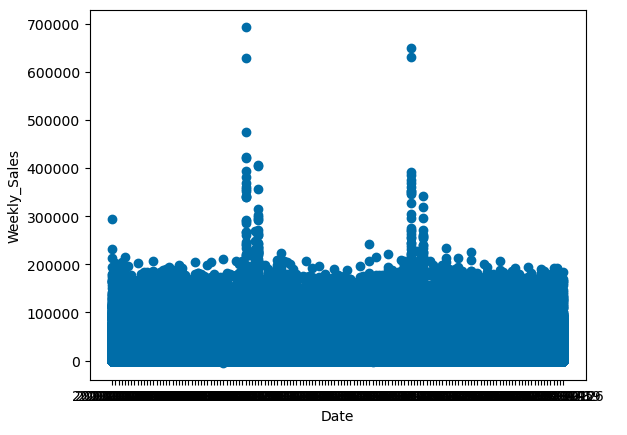
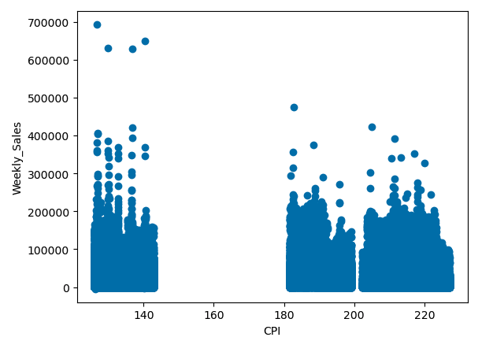
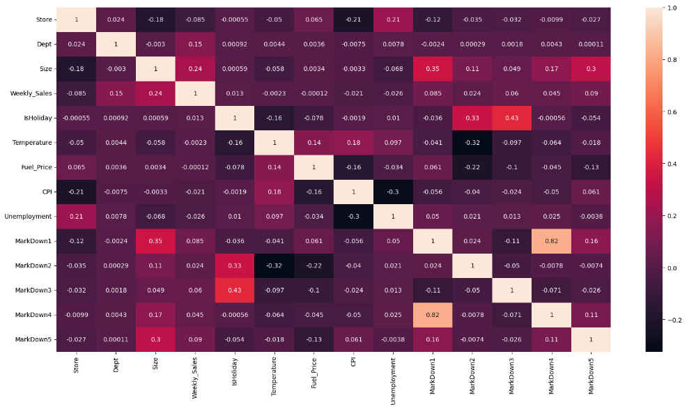
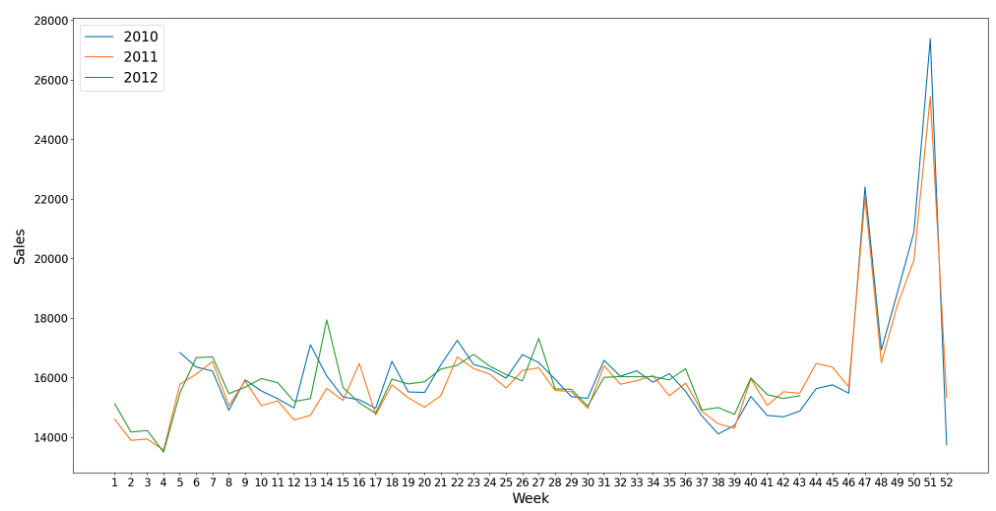
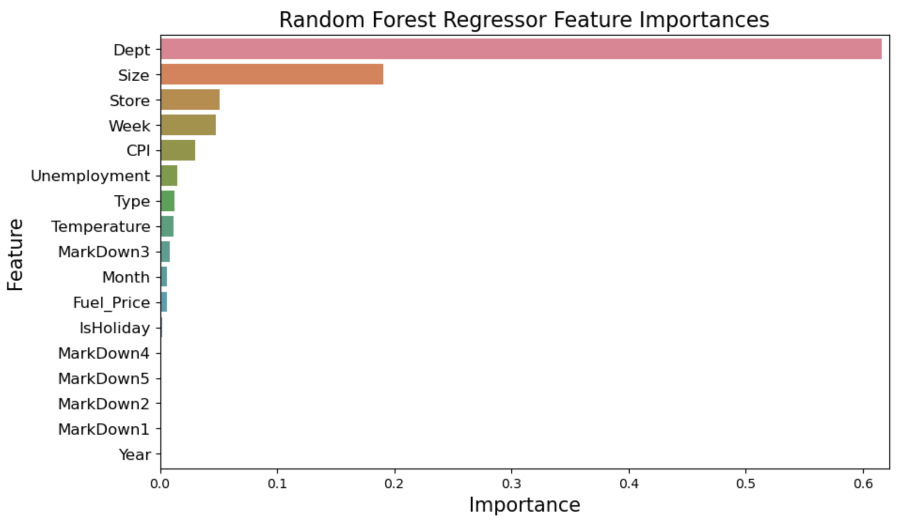

# Walmart-Sales-Forcasting

Using historical sales data to predict future sales

## Overview

The ability of manufacturers, resellers and retailers to properly forecast sales has always been a key determinant of their success. Despite the increased availability of forecasting/planning tools and the backdrop of persistent global supply chain challenges, many small and medium businesses do not employ formal forecasting and planning tools to inform business decisions. As the world continues to grapple with the ongoing COVID-19 pandemic, deglobalization and a host of other geopolitical issues, efficiently managing supply chains will continue to be a challenge for most business. However, recent recent advances in machine learning techniques for modeling time series data offers an opportunity for companies of all sizes to not only survive an unpredictable global market but also thrive.

## Business and Data Understanding

### Stakeholders & Business Problem

- Covid has highlighted the importance of sales forecasting/demand planning capabilities for manufacturers, wholesalers, and retailers
  - Ex: Peloton Covid demand surge CapEx
- Without sales forecasting/demand planning tools, Walmart’s marketplace sellers are unable to optimally plan their business activity  
  - However implementation of ERPs/CRMs is too resource intensive for many (smaller) Marketplace sellers
- Our team, Walmart Store Sales DS, has been engaged by members of the Marketplace Strategy and Product teams to develop a prototype solution for Marketplace vendors
- Can we leverage our expertise in forecasting Walmart store sales to develop an affordable sales forecasting/demand planning solution for Walmart Marketplace sellers?
  
### Data Understanding

Source and Methodology

- Historical Walmart store sales data
  - 2.75 yrs (2010-02-05 to 2012-10-26)
- Data was collected internally by Walmart's finance team
  - Certain historical data was deleted prior to handoff to simulate the less than ideal data we expect our sellers to have at their disposal
- Target variable is Weekly Sales
- Features include various internal and external factors
  - Internal ex: store type, size, markdown levels, promotional periods
  - External ex: CPI, temperature, gas prices

Prior to modeling, EDA was performed to identify any trends, issues, and preprocessing requirements.

We first examined the relationship between our target variable (weekly sales) and selected factors to gain insights into how to best construct our model.

Distribution of weekly sales over time



- Highlights how certain factors can have huge effects on consumer demand and store sales
- As could be expected given the relation between retail activity and holidays, a given date -as evidenced by the two large spikes- can clearly play a very large role in determining sales volume

Distribution of weekly sales over inflation levels



- This example highlights that common external factors, such as inflation, might not influence sales activity to the degree many would assume it would
- While the spread of inflation rates in our window is not very big, sales for the three buckets of inflationary rates are surprisingly relatively evenly distributed

Numeric feature correlation



- There aren't any numeric features which immediately stand out as being highly correlated
- We will conduct feature engineering to ensure we extract maximum predictive power from our data

Annual average weekly sales



- This chart further reinforces the importance of date as a feature
- Drilling down on weeks where sales spike and mapping those periods to dates unlocks a number of insights into which holidays drive sales and the different ways individual holidays shape sales activity

Data Methodology

- General feature engineering
  - Ordinally encoded the store type variable
  - Extracted the year, month, and week from the date associated with each record
- Holiday/promotional period feature engineering
  - Our experience in store sales has emphasized the importance of considering holidays/promotional periods when planning business activity
- Basic pipelines and column transformers were built to iterate through different models and scaling techniques
  - This architecture will allow us to scale more complicated transformation in the future
- Pipelines were passed to random forest regressors for modeling

## Modeling

To forecast sales, our team uses sklearn's RandomForestRegressor. Rather than research new models, our approach for this stage of development focuses on feature selection. As our understanding of the data and viable applications grows and our focus shits to fine tuning models for production, we may to test other models in addition to engineering additional parameters.

### Results

#### Baseline model

- Included all features without any transformations
- Scoring:
  - RMSE: 5,030.87
  - MAE: 2,296.40

#### Model iterations

Scaling features

- Took opportunity to establish pipeline and column transform to aid in scaling future model feature complexity
- MinMaxScaler
- Scoring:
  - RMSE: 5,037.66
  - MAE: 2,295.92

- Scores are in line with the baseline model. While we don't see the upside of scaling here with this limited dataset. In order to ensure the viability of our model being reproduced and scaled in production, we keep the MinMaxScaler transformation in for all future iterations.

Only date and holiday features

- Scoring:
  - RMSE: 22,113.89
  - MAE: 14,879.50
- Results were significantly worse, clearly there is predictive power in some of our other features

Leveraging RandomForestRegressor features methods to visualize feature importance



Modeling the top 10 features based on feature importance

- Top 10 Feature Importances:
  - 'Dept'
  - 'Size'
  - 'Store'
  - 'Week'
  - 'CPI'
  - 'Unemployment'
  - 'Type'
  - 'Temperature'
  - 'MarkDown3'
  - 'Month'

- Scoring:
  - RMSE: 5,063.34
  - MAE: 2,294.50

Manual Feature Selection

- Leveraging EDA insights (distribution visualizations) and domain knowledge to select features
- Scoring:
  - RMSE: 3,545.91
  - MAE: 1,672.03
- Best results

### Evaluation

The metrics used to evaluate our models are RMSE and MAE

- RMSE
  - Root mean squared error
  - Standard deviation of the residuals (prediction errors)
  - Gives more weight to large errors
- MAE
  - Mean absolute error
  - Calculated as the sum of absolute errors divided by the sample size
  - Easier to interpret
- Features of both metrics
  - In the unit of the target variable
  - Non negative and disregard error direction
  - Lower the better

## Conclusion

### Observations

- Even with incomplete historical sales data, we can cheaply and reliably forecast future sales

- This tool can provide material benefit for Marketplace sellers
  - Could become a significant differentiator re Walmart Marketplace's ability to compete with the likes of Amazon

- We believe equipping sellers with our forecasting tool can only improve the marketplace experience 
  - sellers being able to optimize planning and respond to market trends allows for a more seamless customer experience
  - the value of the tool to sellers lures more sellers to marketplace giving customers access to a broader range of goods and solidifies Walmart's positioning as the one stop shop

- The benefits of this tool could trickle down throughout the Walmart ecosystem
  - the better the marketplace is able to meet our customers' needs, the more time they will spend on walmart.com
  - we expect increased time and spend on our platforms to be a catalyst for improved sale conversion as it creates additional opportunities for activities such as cross sales
  - the additional data derived from the increase in marketplace activity will allow for the continuous improvement and spearheading of tools such as this one

### Future Recommendations

Next steps:

- Additional feature engineering
  - Identify additional date related factors potentially driving sales fluctuations
  - Are there external factors, which might be affecting sales which he haven’t considered/ have data for (e.g. GDP, local cost of living metrics, equity market values)?
- Construct separate models for different Marketplace Seller Segments
  - Not all sellers will have a product mix which tracks the traditional holiday calendar
  - Ex: pool/beach supply sellers

## Repo Structure

```
├── data
├── imgs
├── .gitignore
├── forecasting-walmart-sales.ipynb
├── README.md
└── Walmart-Sales-Forecasting-Presentation.pdf
```
